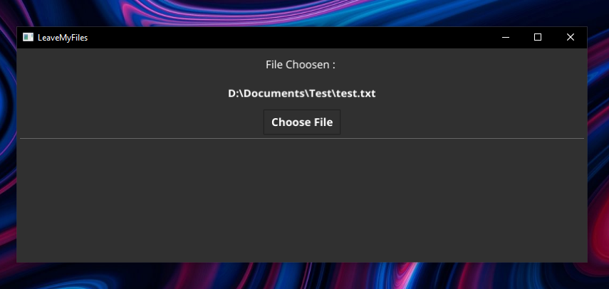

# LeaveMyFilesAlone
### ⚠ Linux Support Soon... ⚠
A simple GO program who detect when a process open your selected file !
#### If you want to recompile the project on windows do like this
```batch
go build -ldflags -H=windowsgui
```
### Execute the binary and choose your file <br />
 <br />
 <br />
### When the file is selected you will see this : <br />
 <br />
### If the file has been opened, you will see this : <br />
#### Notification :


## More features will be coming in the future...
